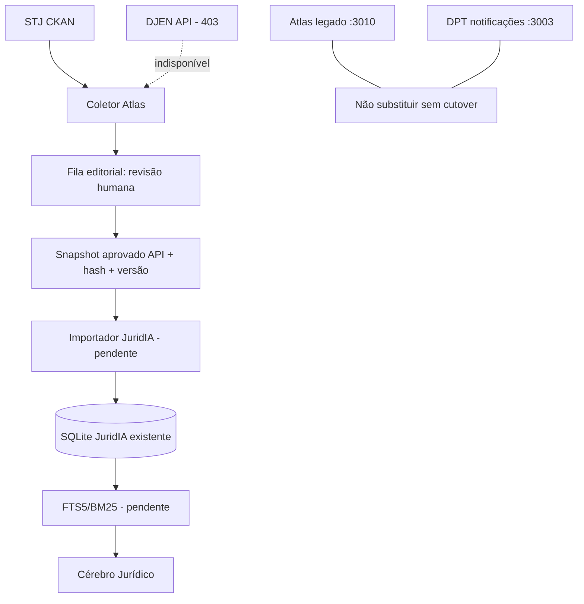

# Auditoria consolidada: Atlas Forense, JuridIA e execução na VPS
_Data: 10/10/2026. Escopo: prompt de ingestão diária, RAG gratuito e mapeamento Graphify._

## Decisão operacional

**GitHub é o código-mestre; a VPS pode compilar e testar diretamente, sem GitHub Actions.** A instalação Woodpecker existente tem servidor, banco e quatro agentes saudáveis em contêineres, mas não se presumiu pipeline Atlas configurado. Nenhum runner da Verdelimp foi reutilizado. Não acrescentar um segundo CI sem necessidade.

## Mapeamento

- Graphify CLI **já instalado** no host; atualizado em modo `code-only`, 424 arquivos, 3.286 nós, 6.775 relações, 193 comunidades; nenhum arquivo jurídico ou documento privado transmitido a um modelo externo.
- Grafo navegável: `/opt/atlas-juridico/audit-vps-graphql-20261010/graphify-out/graph.html` (**somente VPS, não publicado na web**). Relatório e inventário de rotas nos documentos desta branch.
- 18 namespaces tRPC Atlas; 59 arquivos de rotas Next e 96 handlers no JuridIA. Os pontos de maior acoplamento incluem autenticação, DB, roteadores e pipeline de minutas.
- Mapa de grafo é estático; a verdade sobre conexão exige testes de runtime separados.

## Resultado das verificações

| Objeto | Situação observada | Diagnóstico/ação |
|---|---|---|
| Atlas atual da produção | `atlas-juridico.service` em execução, porta 3010 | **Não substituído**, usa stack legada Next |
| DPT ERP | `dpt-erp.service` ativo | Preservado |
| DPT notificações | `dpt-notificacao.service` ativo, porta 3003 | Preservado |
| Novo Atlas | Build, tsc e 215 testes aprovados na VPS em worktree isolado | Código passível de staging, não homologado com DB |
| Falha de escuta 3010 | No código antigo, o servidor escolhia uma porta vizinha quando a indicada estava ocupada | **Corrigido:** em produção, colisão resulta em `ATLAS_PORT_ALREADY_IN_USE` e exit code 1, comprovado em teste |
| Websocket novo Atlas | Porta fixa 3003, conflita com DPT | **Corrigido para staging:** `ATLAS_REALTIME_ENABLED=false`, sem provocar startup do listener |
| Autocoleta em staging | Jobs em memória poderiam iniciar junto com o server | **Corrigido:** `ATLAS_BACKGROUND_SYNC_ENABLED=false` desabilita em staging |
| JuridIA logs Prisma | `log:['query']` registrava SQL, com risco de dados de cliente | **Corrigido** para somente `error` e `warn` |
| Atlas staging 3114 | `/healthz` 200, contrato protegido sem token 503 | Aprovado o smoke de HTTP/autenticação negativa |
| Atlas staging sem DATABASE_URL | `/api/trpc/sources.list` retorna HTTP 500 | Bloqueio de banco no ensaio, investigar com DB real autorizado |
| MariaDB local | Unit inativa e nenhuma escuta 3306 observada | **Bloqueio de deploy produtivo**; não criar DB vazio sem inventariar dados existentes |
| JuridIA production | Nenhuma escuta na porta 3005, SQLite de ~51 MB presente | A montagem de banco/Prisma necessita homologação e backup |
| STJ CKAN | Dry-run público consultou metadados de 3.185 recursos | Disponível, ingestão de dados íntegros ainda não implementada |
| DJEN | HTTP 403 na VPS | Sem API disponível para job diário nesse ambiente |
| DataJud | Uso exclusivo para escritório informado pelo titular | **Não ativado**: verificar conformidade com termos CNJ e finalidade |
| GraphQL | Não solicitado; foi erro de interpretação | Dependência experimental revertida; nenhuma nova API GraphQL |

## Matriz do prompt original: implementado vs pendente

| Requisito | Status | Limite real |
|---|---|---|
| Coletor STJ CKAN incremental, paginação, metadados | **Parcial** | Metadata fingerprint e fila editorial; faltam hash de arquivo, download autorizado, conteúdo e licença verificada |
| Atualização diária com trava de concorrência | **Parcial** | Lock/runKey em código, template systemd, não instalado/ativado; job sem banco real não homologado |
| DJEN/Comunica diário | **Bloqueado externamente** | Adaptador com privacidade e testes; HTTP 403; não contornar |
| DataJud para metadados e jurimetria | **Pré-existente/parcial** | Nenhuma nova carga diária habilitada; regras CNJ ainda exigem conferência |
| STF, TJMG, TST e LexML | **Parcial/manual** | Sem novas APIs oficiais de corpus integral; sem scraping massivo |
| Fila de aprovação humana | **No código, não homologada com DB** | Reusa `editorial_updates`; aprovação não confere por si só o inteiro teor de decisões |
| Deduplicação por recurso, versão e hash | **Parcial** | Hash de metadados CKAN, não dos bytes da fonte |
| Snapshot Atlas → JuridIA | **Parcial** | API com token e SHA-256 do conjunto; **somente metadados de descoberta aprovados**, não textos legais citáveis |
| Importação em banco próprio JuridIA | **Pendente** | Cliente HTTP criado, mas não foi implementado cache persistente transacional por snapshot no SQLite |
| FTS5/BM25 | **Pendente** | Nenhuma implementação FTS5/BM25 encontrada no `src` JuridIA auditado |
| Embeddings locais opcionais | **Pendente nesta branch** | Não foi encontrado fluxo OLLAMA `/api/embed` ou equivalente no JuridIA auditado |
| Fallback lexical em caso de indisponibilidade | **Parcial** | TF-IDF/rag_lite existente; faltam testes integrados do novo fluxo |
| Casos de falha e sigilo | **Parcial** | Testes unitários cobrem autenticação e privacidade; falta homologação end-to-end com dados licenciados e infra real |
| Deploy e rollback | **Bloqueado** | Não existe produção MariaDB nova homologada, CI externo irrelevante diante de falta de DB e porta conflitada |

## Arquitetura de referência sem duplicação



## Gate de publicação direta na VPS

Só promover uma versão quando: checkout/commit exatos; banco MariaDB localizado e estrutura validada sem apagamento; backups pré-deploy verificáveis de MariaDB/SQLite; migrations aditivas revisadas; testes e build completos; health + contratos autenticados; portas dedicadas; rollback ensaiado. Até lá, **o deploy de homologação deve permanecer isolado**, sem tocar no Atlas legado e no DPT.

### Comandos repetíveis sem GitHub Actions

```bash
cd /opt/atlas-juridico/audit-vps-graphql-20261010/apps/atlas-forense
pnpm install --frozen-lockfile
pnpm check
pnpm test
pnpm build
# No staging, usar PORT=3114 HOST=127.0.0.1 e desabilitar realtime/background jobs.
# A publicação de produção exige backup e validação de MariaDB/rotas.
```
